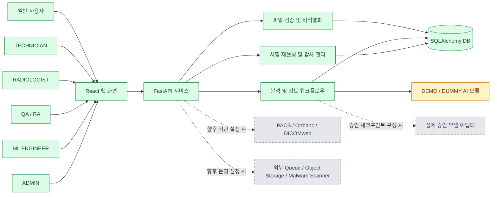
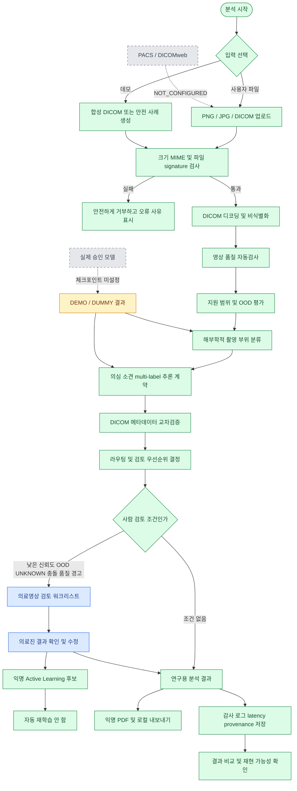
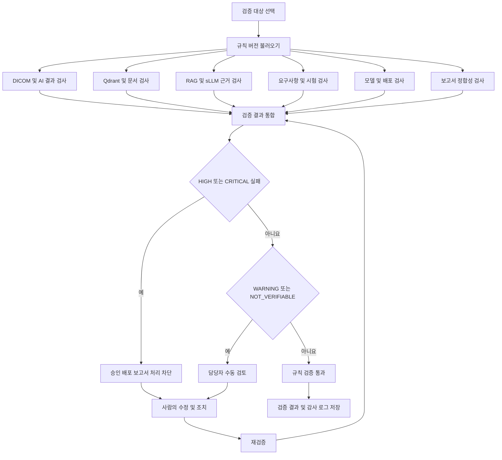
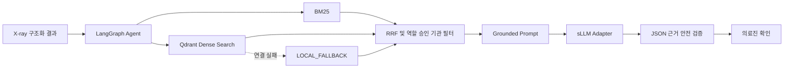

# X-Ray Anatomical Region Classification & Routing System

> X-ray 영상 분석, sLLM 업무지원, Qdrant 지식검색 결과를 하나의 정합성 검증 에이전트가 파트별로 검사하고, 검증 결과를 통합하여 의료진 검토·품질관리·모델 배포 판단을 지원하는 시스템입니다.

영상 AI, 언어모델, 검색 결과와 운영 기록 사이의 누락·충돌을 추적하는 연구·교육용 플랫폼입니다. 정합성 검증 에이전트는 의료진의 진단이나 최종 판단을 대체하지 않으며, 검증 불가능한 항목은 통과로 처리하지 않습니다.

## X-ray AI 구축 및 분석 지원 확장

새 `/api/v1/xray` 흐름은 PNG/JPG/DICOM 검증 → 메모리 내 비식별 처리 → 품질·부위 분류 → 10개 이상 의심 소견 multi-label 추론 → 불확실성/OOD → 의료진 검토 → 익명 PDF를 통합합니다. 기존 API는 그대로 유지됩니다.

- 실제 모델: 승인 체크포인트, 체크포인트 해시와 검증 자료가 구성된 경우에만 사용하며 실제 Grad-CAM만 제공합니다.
- 기본 모델: `dummy-finding-v1`은 파일 SHA-256 기반 재현용 DUMMY이며 임상 성능을 의미하지 않고 히트맵을 제공하지 않습니다.
- PACS/Orthanc, 운영 인증, 실제 소견 체크포인트: `NOT_CONFIGURED`.

주요 API는 `POST /api/v1/xray/analyze`, `POST /api/v1/xray/analyze-batch`, `GET /api/v1/xray/analyses/{id}`, `/heatmap`, `/report`, `GET /api/v1/xray/worklist`, `PATCH /api/v1/xray/analyses/{id}/review`입니다.

검증 결과: 백엔드·ML **67 passed**, 프론트엔드 **10 passed**, TypeScript/Vite 빌드 성공. 현재 환경에는 Docker CLI가 없어 `docker compose config`는 실행하지 못했습니다.

이 결과는 연구·교육용 분석 지원 정보이며 의료진의 진단이나 치료 결정을 대체하지 않습니다. 포트폴리오에서는 DICOM 보안, 다중 라벨 ML 계약, Human-in-the-loop, 모델 계보, 감사 로그와 책임 있는 AI를 강조합니다.

> Phase 23 adds AI literacy, versioned consent, measured latency, model/dataset cards, misclassification reporting, Human-in-the-loop controls and a responsible AI risk dashboard. The bundled model remains explicitly **DEMO / DUMMY** and is not for diagnosis or treatment decisions.

## 공동 개발

`jeongjun7464-sudo`와 `junhaj27-jpg` 모두 동일한 코드베이스에서 브랜치와 Pull Request 방식으로 개발할 수 있습니다. 계정별 로컬 Git 작성자 설정, Collaborator/Fork 방식과 병합 전 검증 절차는 [CONTRIBUTING.md](CONTRIBUTING.md)를 따릅니다. 코드 소유권 리뷰 요청은 [.github/CODEOWNERS](.github/CODEOWNERS)에 두 계정을 등록했습니다.

X-ray/DICOM 영상을 해부학적 촬영 부위로 분류하고, 영상 품질과 메타데이터를 교차검증한 뒤 적절한 분석 또는 검토 대기열로 연결하는 취업 포트폴리오용 풀스택 프로젝트입니다.

> **연구·교육 및 시스템 통합 검증용입니다.** 질병을 진단하거나 촬영을 재지시하지 않으며 의료진의 판단을 대체하지 않습니다. 기본 `dummy-v1` 결과는 워크플로 시연용으로 실제 의료 AI 성능을 의미하지 않습니다.

## 구현된 전체 흐름

```text
합성/익명 영상 업로드
→ 파일·DICOM 검증 및 비식별 미리보기
→ 영상 품질/OOD 검사
→ 촬영 부위 분류와 메타데이터 교차검증
→ 규칙 기반 파이프라인 또는 검토 대기열 라우팅
→ 검토자 수정·감사 로그·능동학습 후보 등록
→ 익명 PDF / 실험용 DICOM SR / 로컬 FHIR Bundle 내보내기
```

## 사용 가능한 기능 전체 목록

기능 상태는 `DEMO/DUMMY`(합성 데이터와 결정적 더미 모델로 동작), `LOCAL`(로컬 DB·파일·큐에서 실제 동작), `PARTIAL`(인터페이스는 구현됐으나 외부 시스템 미연결), `NOT_CONFIGURED`(안전하게 비활성화)로 구분합니다. 이 저장소에는 임상 운영 승인을 받은 `PRODUCTION` 기능이 없습니다.

### 사용자 화면

| 화면 | 이용 가능한 기능 |
|---|---|
| 대시보드 | 분석 건수, 검토 필요 현황, 최근 분석 진입 |
| 통합 X-ray 분석 | PNG/JPG/DICOM 업로드, 품질·OOD·부위·의심 소견 분석, 익명 결과 확인 |
| 비교·데이터셋·모니터링 | 이전/현재 영상 비교, 데이터셋 구축 상태, 실패 분석, 모델 모니터링, 문서 초안 |
| 의료기관 운영 | PACS·DB·모델·큐 상태, Study 워크리스트, Model Release Gate, CAPA |
| 검증·감사 대응 | provenance, 시험 시나리오, 합성 안전 사례, 라벨 일치도, 공정성, 복구 작업, 감사 패키지 |
| 부위 분류 | 합성 DICOM 데모, 파일 업로드, 8개 부위와 상위 3개 후보 |
| 검토 대기·분석 이력 | 낮은 신뢰도·OOD·품질·메타데이터 충돌 결과 조회와 수정 |
| 성능 통계 | 실제 저장 결과 기반 통계 및 검증 자료 부재 시 `NOT_MEASURED` |
| AI 리터러시 | 역할별 교육, 신뢰도 설명, 용어사전, 퀴즈, 사용자 동의 |
| 기관 연동 관리 | 프로토콜, 코드 매핑, 라우팅 규칙, feature flag와 서비스 상태 |
| 포트폴리오·시스템 정보 | 구현 기술, 모델·데이터 출처, 버전, 제한사항과 면책 고지 |

모든 주요 화면에는 loading, empty, error, success 상태를 제공하며 검증·감사 화면에는 permission-denied 상태도 제공합니다.

### 영상 입력·DICOM·보안

- PNG, JPG/JPEG, DICOM 단일 분석과 최대 20개 배치 분석
- 확장자, MIME type, 파일 signature 교차검사 및 업로드 크기 제한
- DICOM `MONOCHROME1/2`, rescale, windowing, 다중 프레임 첫 프레임 처리
- PatientName 등 식별 태그 제거, UID·파일의 SHA-256 익명 해시
- ZIP 경로 조작·절대경로·심볼릭 링크·중첩 ZIP·압축 폭탄·파일 수 검사
- 실제 환자정보 입력 필드 차단과 제한 임상정보 allowlist
- 악성코드 검사 adapter 상태 조회: 외부 엔진 미연결 시 `NOT_CONFIGURED`
- 요청 ID와 감사 이벤트 연결, 비밀값 로그 마스킹 구조

### AI 분석·설명·라우팅

- 8개 해부학적 촬영 부위 분류, 신뢰도와 상위 3개 후보
- 10개 이상 의심 소견 multi-label 추론 계약과 소견별 임계값
- 밝기·대비·흐림·빈 영상·해상도 품질 검사와 `PASS/WARNING/REJECT`
- 최대 확률·entropy 기반 `IN_DISTRIBUTION/OUT_OF_DISTRIBUTION/UNKNOWN`
- DICOM Modality, BodyPartExamined, 설명, 촬영 방향, 좌우 방향과 AI 결과 교차검증
- CHEST/SPINE/HAND_WRIST/KNEE별 안전 라우팅과 UNKNOWN 검토 대기
- dummy 결과의 Grad-CAM 차단, 실제 모델 artifact만 표시하는 Viewer 계약
- 원본·히트맵·오버레이, 투명도·확대·이동·밝기·대비 컨트롤 UI
- DenseNet121, EfficientNetV2, ConvNeXt, ONNX 모델 비교 계약
- 랜드마크·OCR 검토·detection·불확실성·전처리 비교·stress-test 연구 API

### Study·의료기관 운영

- 익명 Study/Series/SOP UID 해시, AP/PA/LATERAL 그룹화와 중복 SOP 차단
- 필수 촬영 방향 누락 검사, 영상별 결과와 Study 종합 결과 분리
- 결과 충돌 시 의료진 검토 라우팅 및 사유·규칙 버전 저장
- `ROUTINE/REVIEW_REQUIRED/HIGH_PRIORITY_REVIEW/QUALITY_REJECTED` 우선순위
- 관리자의 우선순위 임계값 변경과 변경 사유 감사 기록
- Orthanc REST, DICOMweb QIDO-RS/WADO-RS/STOW-RS adapter 계약
- 실제 PACS 미연결 시 `NOT_CONFIGURED`, 외부 전송 기본 비활성화
- 로컬 FHIR R4 예제 Bundle, 실험용 DICOM SR, 익명 PDF 보고서
- HMAC 웹훅 서명과 로컬 전송 대기열

### 의료진 검토·라벨·능동학습

- 낮은 신뢰도, OOD, UNKNOWN, 메타데이터 충돌, 품질 경고 워크리스트
- 의료진의 부위·소견 수정과 수정 전후 감사 이력
- 수정 결과를 익명 active-learning 후보로 저장하며 자동 재학습 비활성화
- LABELER 1차 판독, RADIOLOGIST 독립 2차 판독과 자동 불일치 탐지
- ADJUDICATOR 합의 판독·최종 승인 및 승인 전 학습 데이터 제외
- 부위·소견별 판독자 일치율과 표본 수 조회
- 익명 active-learning 및 승인 라벨 CSV 내보내기

### 데이터셋·모델 수명주기

- DICOM 비식별화, SHA-256 중복 제거, 환자 단위 train/validation/test 분할
- 다중 소견 라벨링·승인, CSV manifest와 데이터셋 버전 관리
- 모델명·버전·체크포인트 SHA-256·학습/시험 데이터 버전 등록
- `REGISTERED → VALIDATING → APPROVAL_REQUIRED → APPROVED → DEPLOYED` Release Gate
- 필수 시험·기존 모델 비교·승인자·승인 사유·롤백 모델 기록
- 승인되지 않은 모델의 배포·추론 차단과 배포 모델 롤백
- 모델 카드, 데이터셋 카드, 배포 계보와 feature flag

### 분석 재현·시험·공정성

- 입력 SHA-256, 전처리/모델/체크포인트/데이터셋/임계값/규칙/앱 버전, 환경, seed 저장
- 두 분석의 입력·설정·부위·소견 확률 차이 비교
- 원본 미보존 시 재실행을 성공 처리하지 않고 `RAW_INPUT_NOT_RETAINED` 반환
- 요구사항·위험·시나리오·실행·증적·결함·재시험 연결
- NORMAL, BOUNDARY, NEGATIVE, SECURITY, PERFORMANCE, RECOVERY, USABILITY 시험
- BLUR부터 DATABASE_FAILURE까지 15종 합성 안전 사례와 기대 결과
- 연령대·성별·장비·기관·촬영 방향·품질 그룹별 공정성 지표
- sensitivity, specificity, precision, recall, F1, AUROC, FPR/FNR과 표본 수
- 최소 표본 미달 또는 검증 자료 부재 시 `INSUFFICIENT_DATA`

### 장애 대응·모니터링·CAPA

- `QUEUED/PROCESSING/SUCCEEDED/RETRY_PENDING/QUARANTINED/FAILED/MANUAL_REVIEW` 작업 상태
- Idempotency-Key 중복 분석 차단, 제한 횟수 지수 백오프, 실패 작업 격리
- 추론 서버 장애 시 의료진 검토 전환, 관리자 수동 재처리, 롤백 후 재처리
- 총 분석, 성공률, 평균/P95 latency, 품질 REJECT, OOD, 검토, API 오류율
- 모델별 사용 건수, 최근 오류와 PACS·DB·모델·큐 상태
- 반복 오류 임계값 기반 CAPA 후보, 원인·시정/예방조치·담당자·기한·효과성·승인 상태

### 책임 있는 AI·교육·Agent

- 신뢰도와 정확도의 차이, UNKNOWN, 검토 상태, Grad-CAM 한계 설명
- 업로드·디코딩·비식별화·전처리·추론·Grad-CAM·DB·전체 latency
- 평균, P50/P95/P99, 처리량, timeout, CPU/GPU와 모델별 속도 비교 계약
- 일반 사용자·검토자·관리자·개발자별 교육과 객관식 퀴즈
- 버전형 사용자 동의, 오분류 신고, Human-in-the-loop 보호
- 책임 있는 AI 대시보드, 위험 등록부, 한국어 용어사전과 접근성 지원
- 14단계 LangGraph 기반 업무지원 Agent와 구조화된 X-ray 결과 연결
- Qdrant dense vector와 BM25/RRF 하이브리드 검색, 장애 시 `LOCAL_FALLBACK`
- deterministic dummy, vLLM, OpenAI-compatible sLLM adapter와 JSON Schema 검증
- 승인·역할·기관·유효기간 필터, citation 검증, `NO_EVIDENCE/DEGRADED` 상태
- prompt injection·개인정보 차단, 도구 allowlist, 변경 제안 후 사용자 확인

### 감사·문서·내보내기

- 요구사항 명세, 위험관리, 검증 계획/결과, 모델 변경 영향평가 문서 초안
- 요구사항 → 위험 → 구현 파일 → API → 테스트 → 결과 추적성 매트릭스
- requirements PDF, 위험관리 XLSX, 데이터셋 명세, 모델 카드, 검증 보고서
- 승인·변경·CAPA CSV, 추적성 XLSX와 manifest를 포함하는 감사 ZIP
- 패키지와 구성 파일 SHA-256, 생성 시각, 관련 버전, 생성자 역할 기록
- 생성 후 내용 변경 시 `INTEGRITY_FAILED`로 다운로드 차단

### 역할과 권한

| 역할 | 허용되는 대표 작업 |
|---|---|
| `TECHNICIAN` | 영상/Study 등록, 분석·복구 작업 요청 |
| `LABELER` | 첫 번째 익명 라벨 작성 |
| `RADIOLOGIST` | 독립 2차 판독, 결과 검토와 우선순위 수정 |
| `ADJUDICATOR` | 불일치 합의 판독과 최종 라벨 승인 |
| `ML_ENGINEER` | 모델 등록·검증 요청, 공정성 평가 |
| `QA_RA` | 시험 실행, 모델 승인, CAPA와 감사 패키지 관리 |
| `ADMIN` | 모델 배포·롤백, 규칙·연동·사용자·수동 복구 관리 |
| `REVIEWER` | 기존 분석 검토 및 태그 수정 호환 역할 |

현재 권한 검사는 포트폴리오용 `X-Role` 헤더 방식입니다. 허용되지 않은 작업은 403을 반환하지만 운영용 OIDC/OAuth2 인증과 관리자 재인증은 아직 연결되지 않았습니다.

## 주요 기능

### 분류·품질·검토

- 8개 해부학적 부위, 신뢰도 및 상위 3개 결과
- pydicom window/rescale와 `MONOCHROME1`·`MONOCHROME2` 처리
- 밝기, 대비, 흐림, 빈 영상, 해상도 기반 `PASS/WARNING/REJECT` 품질 판정
- 신뢰도, predictive entropy, DICOM Modality 기반 OOD 탐지
- DICOM 메타데이터와 AI 결과 충돌 검사
- 부위별 안전한 분석 라우팅과 낮은 신뢰도 자동 검토
- 우선순위 기반 워크리스트, 검토 수정, 감사 로그
- 익명 능동학습 CSV와 개인정보 없는 PDF 결과 보고서
- DenseNet121, EfficientNetV2, ConvNeXt, ONNX 형식의 명시적 모의 비교 API

### 의료기관 연동 구조

- DICOM UID 해시 기반 검사·시리즈·인스턴스 그룹화와 중복 SOP 차단
- AP/LATERAL 등 동일 검사의 다중 촬영 방향 통합
- DB 관리형 부위별 촬영 프로토콜과 완전성 검사
- 생성 근거가 포함된 검색 태그와 검토자 수정
- 관리자 입력형 SNOMED CT, RadLex, DICOM Body Part 매핑 구조
- `UNVERIFIED/PARTIAL`로 표시되는 연구용 DICOM SR
- FHIR R4 ImagingStudy, DiagnosticReport, Observation, DocumentReference, AuditEvent, Provenance 예제 Bundle
- 우선순위·활성화·버전이 저장되는 규칙 기반 라우팅
- HMAC 서명과 감사 로그가 연결된 로컬 웹훅 대기열
- ZIP 경로 조작, 심볼릭 링크, 중첩 압축, 파일 수·크기·압축률 검사
- 관리자 권한으로 보호되는 서비스 상태 API와 React 관리 화면

### LangGraph 의료영상 업무지원 Agent

- 실제 `StateGraph` 기반 입력 검사→권한→Hybrid Retrieval→도구→grounded prompt→sLLM→근거·안전 검증 흐름
- API 키 없이 실행되는 deterministic dummy Agent와 vLLM/OpenAI-compatible adapter
- 예측·모델·시스템 상태·감사·시험·추적성에 연결된 읽기 도구 7개
- BM25와 Qdrant dense vector 검색을 RRF로 결합하고 Qdrant 장애 시 로컬 검색으로 전환
- 문서 ID·버전·섹션·시스템 도구가 표시되는 근거 기반 답변
- APPROVED·역할·기관·유효기간 문서 필터와 문서별 최대 청크 제한
- 응답 JSON Schema, 실제 검색 citation, 금지 의료 표현 검증
- Agent 대화·검색 순위·LLM latency·상태·안전 결과 DB Trace 저장
- 개인정보 마스킹, prompt injection 차단, 도구 allowlist와 역할 검사
- 변경 도구 제안과 별도 사용자 확인 API 분리
- React 업무지원 화면에서 모델·검색 모드·근거·한계·Trace ID와 degraded 상태 표시
- 개인정보 없는 연구용 DEMO 지식 문서 7개와 색인·재색인·상태 확인 스크립트

### 합성 데이터 데모

- 정상 DICOM, MONOCHROME1/2, 개인정보 태그, 픽셀 없음, 손상 파일
- 잘못된 Modality, 메타데이터 충돌, 대형 영상 변형
- 합성 DICOM 생성부터 업로드·분류·검토·보고서까지 시연
- 합성 데이터는 시스템 기능 검증 전용이며 모델 성능 평가에는 사용하지 않음

## 시스템 이용 구조도

아래 구조도는 사용자가 접하는 화면과 실제 서비스 계층, 시연용 AI, 향후 외부 연동 경계를 구분합니다.



- 녹색 실선: 저장소에서 실제 동작하는 애플리케이션 기능
- 노란색: 합성 입력과 결정적 결과를 사용하는 `DEMO/DUMMY` 기능
- 회색 점선: 인터페이스만 제공되며 외부 설정 전에는 `NOT_CONFIGURED`인 향후 연동 기능

## 전체 분석 워크플로우

분석 결과는 연구·교육용 보조 정보이며 낮은 신뢰도, 품질 문제, OOD 또는 메타데이터 충돌이 있으면 사람이 검토합니다.



실제 모델이 구성되지 않은 기본 환경에서는 분류·소견 결과가 `DEMO/DUMMY`로 표시되고 실제 Grad-CAM은 비활성화됩니다. PACS, DICOMweb, 외부 악성코드 검사, 외부 큐와 객체 저장소는 설정 전까지 연결 성공으로 표시하지 않습니다. 워크리스트의 결과 확정과 수정은 권한을 가진 검토자가 수행합니다.

## 통합 정합성 검증

X-ray·DICOM·검토·Qdrant·RAG·sLLM·모델 배포·보고서·요구사항 시험의 누락과 충돌을 버전형 규칙으로 검사한다. 규칙 결과와 LLM 제안을 구분하며 검증할 수 없는 항목은 `NOT_VERIFIABLE`로 표시한다. HIGH/CRITICAL 실패는 승인·배포·보고서 처리를 차단하거나 사람에게 전달할 뿐 데이터를 자동 수정하지 않는다.



공통 상태는 `PASS`, `WARNING`, `FAIL`, `NOT_APPLICABLE`, `NOT_VERIFIABLE`, `BLOCKED`, `MANUAL_REVIEW_REQUIRED`이며 심각도는 `INFO`부터 `CRITICAL`까지다. 대시보드는 아이콘과 상태 텍스트를 함께 표시한다. 상세 규칙과 요구사항·위험·시험 연결은 [정합성 규칙 카탈로그](docs/consistency-rule-catalog.md)에 있다.

주요 API는 전체/분석/지식/Agent/모델/보고서 검증, 실행·불일치 조회, 담당자 지정·해결 근거 저장과 대시보드를 제공하는 `/api/v1/consistency/*`다. Qdrant가 연결되지 않으면 orphan·missing vector를 0이나 PASS로 만들지 않고 `NOT_VERIFIABLE`로 유지한다.

## 기술 스택

| 영역 | 실제 연결 기술 |
|---|---|
| Frontend | React, TypeScript, Vite, Vitest |
| API | FastAPI, Pydantic, multipart upload |
| Medical imaging | pydicom, Pillow, NumPy |
| ML structure | PyTorch, torchvision, DenseNet121, Grad-CAM module |
| Agent / sLLM | LangGraph, deterministic dummy, vLLM·OpenAI-compatible adapter |
| Retrieval | BM25, Reciprocal Rank Fusion, Qdrant REST adapter, local fallback embedding |
| Database | SQLAlchemy, Alembic, SQLite 개발 모드, PostgreSQL Docker 모드 |
| Security | 파일 시그니처 검증, SHA-256 익명 해시, 역할 헤더 검사, HMAC, CSP, rate limit |
| Delivery | Docker Compose, nginx, GitHub Actions |

## sLLM·Qdrant 업무지원 확장

의료영상 분석 결과를 구조화한 뒤 LangGraph Agent가 승인 문서를 BM25와 Qdrant dense vector로 검색하고, 근거가 있을 때만 sLLM에 전달한다. sLLM은 영상 픽셀을 직접 분석하지 않으며 업무지원 JSON만 생성한다. 인용 ID는 실제 검색 결과와 대조하고 모든 답변은 사람의 확인이 필요하다.



- 실제 구현: LangGraph 노드 흐름, BM25/RRF, Qdrant REST adapter, 승인·역할·기관 필터, JSON·citation·안전 검증, trace 저장.
- `DEMO/DUMMY`: 기본 deterministic 언어모델과 로컬 hashing embedding. 동일 입력은 동일 답변을 만든다.
- `LOCAL_FALLBACK`: Qdrant가 없으면 승인된 로컬 문서 검색을 계속하며 상태를 숨기지 않는다.
- 향후 연동: vLLM/OpenAI-compatible endpoint와 운영 Qdrant TLS/API Key. 연결 전에는 실제 sLLM 운영으로 표시하지 않는다.

Qdrant collection `xray_knowledge`에는 문서·버전·청크·섹션·승인·역할·기관·유효기간·content hash·embedding 모델을 저장한다. 환자정보, 원본 DICOM, X-ray 픽셀, 인증정보는 저장하지 않는다.

```bash
docker compose up --build
PYTHONPATH=backend python scripts/check_qdrant.py
PYTHONPATH=backend python scripts/index_knowledge.py
# NVIDIA GPU 환경에서만
docker compose --profile gpu up vllm
```

vLLM 연결은 `.env`에서 `LLM_PROVIDER=vllm`, `LLM_BASE_URL=http://vllm:8000/v1`, `LLM_MODEL_NAME`을 설정한다. 지식 문서는 `docs/knowledge` front matter를 검증하고 개인정보가 없을 때만 색인한다.

평가는 Retrieval의 Hit/Recall@5·MRR·nDCG, Generation의 citation·groundedness·schema·safety, Agent의 intent·tool·권한·완료·latency·fallback을 대상으로 한다. 실제 평가 데이터가 없으므로 성능 수치를 작성하지 않는다.

상세 문서: [sLLM 구조](docs/sllm-architecture.md), [Qdrant 설계](docs/qdrant-collection-design.md), [Hybrid Retrieval](docs/hybrid-retrieval.md), [Agent 흐름](docs/agent-workflow.md), [문서 거버넌스](docs/knowledge-governance.md), [평가](docs/agent-evaluation.md), [배포](docs/sllm-deployment.md).

상세 내용은 [실제 적용 기술 스택](docs/technology-stack.md)과 [아키텍처](docs/architecture.md)를 참고하세요.

## 빠른 실행

### 로컬 개발

```bash
cp .env.example .env
python -m venv .venv
# Windows PowerShell: .venv\Scripts\Activate.ps1
pip install -r backend/requirements.txt
cd backend
uvicorn app.main:app --reload
```

새 터미널에서 프론트엔드를 실행합니다.

```bash
cd frontend
npm install
npm run dev
```

- UI: `http://localhost:5173`
- Swagger API: `http://localhost:8000/docs`
- 기본 DB/모델: SQLite / `dummy-v1`

### Docker Compose

```bash
docker compose up --build
```

- UI: `http://localhost:8080`
- API 문서: `http://localhost:8000/docs`
- Docker DB: PostgreSQL 16

## 주요 API

| API | 설명 |
|---|---|
| `POST /api/predictions` | 단일 영상 검증·분류·품질/OOD 평가 |
| `PATCH /api/predictions/{id}/review` | 검토 결과와 의견 저장 |
| `GET /api/worklist` | 사유·우선순위 검토 목록 |
| `GET /api/demo/synthetic-dicom` | 합성 DICOM 생성 |
| `POST /api/studies/group` | 복수 DICOM 검사·시리즈 그룹화 |
| `GET/PUT /api/admin/protocols` | 촬영 프로토콜 조회·관리 |
| `GET/PUT /api/admin/code-mappings` | 표준 코드 매핑 조회·관리 |
| `POST /api/admin/routing-rules` | 버전 관리형 라우팅 규칙 생성 |
| `POST /api/routing/evaluate` | 규칙 기반 목적지 평가 |
| `POST /api/batches/inspect` | 안전한 ZIP 배치 사전검사 |
| `GET /api/predictions/{id}/fhir` | 로컬 FHIR 예제 Bundle |
| `GET /api/predictions/{id}/dicom-sr` | 실험용 DICOM SR |
| `GET /api/predictions/{id}/report.pdf` | 익명 PDF 보고서 |
| `GET /api/admin/dashboard` | 관리자 서비스 상태 |
| `POST /api/agent/chat` | LangGraph 업무지원 Agent 실행 |
| `GET /api/agent/runs` | 권한 보호된 익명 Agent trace 조회 |
| `POST /api/agent/actions` | 변경 도구 실행 전 제안 생성 |
| `POST /api/agent/actions/{id}/confirm` | 사용자 확인 후 승인된 변경 수행 |
| `POST /api/v1/agent/chat` | Qdrant/BM25 근거 기반 sLLM 업무지원 답변 생성 |
| `GET /api/v1/agent/runs/{trace_id}` | 개인정보 없는 검색·LLM·안전 Trace 조회 |
| `GET /api/v1/retrieval/search` | 관리자 Hybrid Retrieval 및 RRF 점수 시험 |
| `POST /api/v1/admin/knowledge/index` | 승인 문서 검증·청크·임베딩·Qdrant 색인 |
| `GET /api/v1/admin/knowledge/documents` | 문서 버전·승인·검색 활성 상태 조회 |
| `DELETE /api/v1/admin/knowledge/documents/{id}/versions/{version}` | 사유를 기록하고 문서 버전 검색 비활성화 |
| `GET /api/v1/admin/qdrant/status` | Qdrant·Collection·vector·색인 상태 조회 |
| `GET /api/v1/admin/llm/status` | sLLM provider·모델·dummy·최근 latency 조회 |

관리 API 데모 권한은 `X-Role: ADMIN`, 태그 수정은 `ADMIN` 또는 `REVIEWER` 헤더를 사용합니다. 이는 포트폴리오용 최소 RBAC 검사이며 운영 환경에서는 OIDC/OAuth2 인증으로 교체해야 합니다.

```bash
curl -F "file=@synthetic-xray.png;type=image/png" http://localhost:8000/api/predictions
curl -H "X-Role: ADMIN" http://localhost:8000/api/admin/dashboard
curl -F "files=@ap.dcm;type=application/dicom" -F "files=@lateral.dcm;type=application/dicom" http://localhost:8000/api/studies/group
```

## 테스트

```bash
PYTHONPATH=backend:ml pytest backend/tests ml/tests -q
cd frontend
npm test
npm run build
```

현재 검증 기준:

- 백엔드·ML: **67 tests passed**
- 프론트엔드: **10 tests passed**
- TypeScript 검사 및 Vite 프로덕션 빌드 통과

요구사항과 위험, 구현 파일, API, 테스트 연결은 [추적성 매트릭스](docs/traceability-matrix.md)에 기록합니다.

## 모델 학습과 데이터 준비

실제 의료영상, 환자 개인정보 또는 공개 데이터셋 원본을 저장소에 포함하지 않습니다. 폴더 클래스 구조 또는 CSV manifest(`file_path, anatomical_region, laterality, view_position, patient_group_id, institution_id`)를 사용하며 환자 단위 분할로 데이터 누수를 검사합니다.

```bash
pip install -r ml/requirements.txt
PYTHONPATH=ml python ml/train.py --train train.csv --val val.csv --out ml/runs/v1
PYTHONPATH=ml python ml/evaluate.py --manifest test.csv --checkpoint ml/runs/v1/best.pt
```

관련 문서: [데이터 준비](docs/data-preparation.md), [모델 학습](docs/model-training.md), [검증 계획](docs/validation-plan.md).

## 개인정보 보호와 제한사항

- 원본 영상과 직접식별정보는 DB에 저장하지 않습니다.
- UID와 AccessionNumber는 검색 가능한 익명 해시로 저장합니다.
- FHIR 예제는 로컬 합성·익명 데이터만 생성하며 외부 병원으로 전송하지 않습니다.
- DICOM SR은 임상적으로 검증된 진단 보고서가 아닙니다.
- 임의의 SNOMED CT 또는 RadLex 코드를 생성하지 않습니다.
- 실제 가중치와 임상 검증 데이터가 없어 Accuracy/F1 또는 진단 성능을 주장하지 않습니다.
- 실제 웹훅 전송, Redis/Celery worker, Orthanc, MinIO, MLflow, 운영 백업·복구는 연결되지 않았습니다.
- 헤더 기반 역할 검사는 데모 수준이며 완전한 사용자 인증 체계가 아닙니다.
- Grad-CAM 계산 모듈은 있으나 dummy 모델 UI에서는 실제 히트맵을 제공하지 않습니다.

Phase 20 범위는 [의료기관 연동 구현 현황](docs/phase20-implementation-status.md), Phase 21은 [AI 고도화 및 검증 구현 현황](docs/phase21-implementation-status.md), Agent의 실제·부분·미구현 범위는 [Phase 22 Agent 현황](docs/phase22-agent-status.md), 최신 시험 결과는 [자동 검증 요약](docs/validation-summary.md)에서 확인할 수 있습니다.

## 저장소 원칙

- 라이선스 동의나 로그인을 우회하지 않습니다.
- 실제 의료영상, 개인정보, 비밀키와 대용량 모델 아티팩트를 커밋하지 않습니다.
- 설치만 한 기술을 실제 사용 기술로 표시하지 않습니다.
- 검증되지 않은 모델을 자동으로 운영 모델로 승격하지 않습니다.
- 구현하지 않은 기능은 완료로 표시하지 않고 제한사항과 이유를 공개합니다.

## 종단 비교·데이터셋·모니터링

이전/현재 익명 분석 비교, 촬영 조건 불일치 제한, 의료진 수정과 비자동 active-learning 후보 저장, 환자 단위 데이터 분할·중복 제거·라벨 승인·CSV manifest, 모델 배포 계보와 의료기기 문서 초안 생성을 제공합니다. 승인된 검증 정답이 없으면 실패 분석과 성능·드리프트 수치는 `NOT_MEASURED`로 유지합니다. 모든 비교·탐지 결과는 연구·교육용 보조 정보이며 의료진 확인이 필요합니다. 자세한 범위는 [Phase 24 구현 현황](docs/phase24-longitudinal-dataset-monitoring.md)을 참고하세요.

## 의료기관 운영·검증 기능

- Orthanc REST와 DICOMweb QIDO/WADO/STOW 어댑터 계약 및 `NOT_CONFIGURED` 안전 상태
- 합성 DICOM 기반 Study import, 익명 UID 해시, AP/PA/LATERAL 그룹화, 중복 SOP 차단과 필수 방향 검사
- 영상별/Study 종합 결과, 충돌 검토 라우팅, 버전형 우선순위 규칙과 감사 로그
- 제한 임상정보 allowlist와 이름·주민번호·전화·주소 필드 차단
- 모델 등록·검증·승인·배포·롤백 Release Gate 및 승인 전 추론 차단
- 운영 지표, 모델 사용량, 최근 API 오류와 PACS/DB/모델/큐 상태 화면
- 반복 오류 임계값 기반 CAPA 후보와 분석·모델·데이터 버전 추적

자동시험은 현재 **백엔드·ML 67개, 프론트엔드 10개**가 통과하고 TypeScript/Vite 프로덕션 빌드가 성공한다. 실제 PACS/Orthanc 네트워크, 운영 인증, 실제 모델 Grad-CAM, 영속 메트릭 백엔드와 임상 검증은 연결되지 않았다. 따라서 이러한 항목은 구현 완료로 표시하지 않으며 실제 성능 수치도 제공하지 않는다. 자세한 내용은 [PACS 설계](docs/pacs-integration.md), [모델 릴리스](docs/model-release-process.md), [임상 검토](docs/clinical-review-workflow.md), [CAPA](docs/capa-workflow.md), [운영 모니터링](docs/operations-monitoring.md), [RBAC](docs/rbac-matrix.md)을 참고한다.

## 검증·재현·감사 대응

분석 provenance 조회/비교, 원본 미보존 재현 차단, 위험 기반 시험 시나리오, 15종 합성 안전 사례, 독립 이중 라벨링과 합의 승인, 표본 수 기반 공정성 평가, 멱등 복구 작업, 감사 ZIP 및 무결성 검증을 제공한다. 프론트의 **검증·감사 대응** 메뉴는 loading, empty, error, success, permission-denied 상태를 구현한다.

- `PRODUCTION`: 없음. 본 저장소는 연구·교육용이다.
- `DEMO/DUMMY`: 부위·소견 모델, 합성 DICOM/안전 사례.
- `MOCK/LOCAL`: PACS adapter, 장애 주입과 로컬 복구 상태 머신.
- `PARTIAL/NOT_CONFIGURED`: 원본 기반 실제 재실행, 외부 악성코드 검사, 관리자 IdP 재인증, 외부 작업 큐, 실제 PACS/DICOMweb 전송.
- 검증 데이터가 없으면 성능 및 공정성 값을 생성하지 않는다. 자동 생성 감사 문서는 승인 전 초안이다.

세부 설계는 [재현성](docs/reproducibility.md), [시험 관리](docs/test-management.md), [라벨 품질](docs/annotation-quality.md), [공정성](docs/fairness-evaluation.md), [장애 복구](docs/failure-recovery.md), [감사 패키지](docs/audit-package.md), [보안 시험](docs/security-test-plan.md), [비기능 검증](docs/non-functional-validation.md)에 기록했다.
