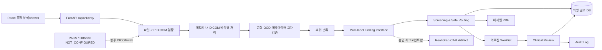

# 통합 X-ray AI 분석 아키텍처

## 계층과 데이터 흐름

FastAPI는 검증 서비스, DICOM 서비스, 품질/OOD 정책, 부위 추론, `xray_findings` 인터페이스, 안전 라우팅, 저장소 순으로 호출한다. React는 통합 업로드, 단계 상태, 밝기·대비·확대·반전 뷰어, 소견 막대, 검토 사유와 PDF 링크를 제공한다.

원본 바이트는 요청 메모리에서만 처리한다. DB에는 익명 SHA-256, 품질·부위·소견·불확실성·라우팅 JSON, 모델/체크포인트 식별자, 검토 전후와 감사 이벤트만 남긴다.

## 모델 및 안전 정책

실제 모델과 DUMMY는 `FindingInferenceEngine.predict`의 동일 반환 계약을 사용한다. DUMMY는 파일 SHA-256 기반으로 재현되며 `dummy_mode=true`, `checkpoint_hash=null`, `explanation_available=false`이다. 실제 Grad-CAM은 승인 체크포인트와 target layer가 구성된 경우에만 저장·제공한다.

품질 REJECT, OOD, 낮은 부위 신뢰도, 임계값 근접 소견, 메타데이터 충돌 및 추론 오류는 확정하지 않고 Worklist로 보낸다. HIGH/MEDIUM은 의료적 응급도가 아니라 검토용 의심 우선순위다.

## 운영과 데모

데모는 SQLite, DUMMY 모델, 합성·비식별 파일을 사용한다. 운영에는 PostgreSQL, OIDC, 객체 저장소, 승인된 체크포인트, 관찰성, 백업과 임상 검증이 추가되어야 한다. PACS/Orthanc는 현재 `NOT_CONFIGURED`이며 향후 DICOMweb 어댑터 지점만 정의한다.
