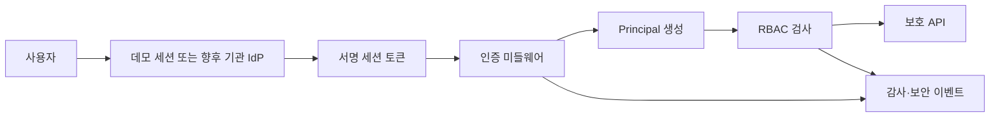

# Phase 26 — 서명 세션 인증과 RBAC

## 문제 정의

기존 `X-Role`/`X-Actor` 헤더는 클라이언트가 임의로 바꿀 수 있어 운영 권한의 근거가 될 수 없다. Phase 26은 기존 개발 테스트의 호환성은 유지하면서, 보안 모드에서는 서버가 검증한 서명 세션만 신뢰하도록 경계를 분리한다.

## 구현 범위

`backend/app/core/auth.py`는 URL-safe payload와 HMAC-SHA256 서명으로 구성된 짧은 세션 토큰을 발급·검증한다. 검증 결과는 `Principal(subject, role, issued_at, expires_at, authentication_method)`이며 미들웨어가 요청 범위에 설정한다. 역할 검사는 클라이언트가 주장한 헤더보다 검증된 Principal을 우선한다.

토큰 payload에는 버전, 익명 subject, 역할, 발급·만료 시각과 임의 jti만 들어간다. 실제 이름·이메일·환자 식별자는 금지하며 서명 비교에는 `hmac.compare_digest`를 사용한다.

데모 API는 `POST /api/auth/demo-token`, `GET /api/auth/me`, `POST /api/auth/logout`이다. 로그아웃은 클라이언트 토큰 삭제만 수행하며 서버 폐기 목록은 `NOT_CONFIGURED`로 명시한다. 이는 임상 운영 인증을 의미하지 않는다.

## 모드

| 설정 | 개발 기본값 | 보안·운영 권장값 |
|---|---:|---:|
| `AUTH_ENFORCED` | `false` | `true` |
| `AUTH_ALLOW_LEGACY_HEADERS` | `true` | `false` |
| `AUTH_DEMO_TOKENS_ENABLED` | `true` | `false` |
| `AUTH_SESSION_TTL_SECONDS` | `900` | 최대 `3600` |
| `AUTH_SESSION_SECRET` | 비어 있음 | 외부 비밀 저장소에서 32자 이상 주입 |

보안 모드에서 비밀값이 짧거나 없으면 시작을 거부하고, production에서는 예제 키와 인증 비강제 설정도 거부한다. 설정상 공개 경로는 health, 모델 정보, 클래스와 API 문서로 제한한다. 데모 토큰 API는 비운영 환경에서 기능 플래그가 활성화된 경우에만 별도로 접근 가능하다. CORS `OPTIONS` 사전요청은 인증 전에 통과시킨다.

## 처리 흐름

## 역할과 공개 API

USER, TECHNICIAN, LABELER, RADIOLOGIST, ADJUDICATOR, ML_ENGINEER, QA_RA, ADMIN, REVIEWER만 허용한다. 세부 권한은 [RBAC 매트릭스](rbac-matrix.md)에 정의한다. 공개 API는 `/api/health`, `/api/model/info`, `/api/classes`, `/docs`, `/openapi.json`, `/redoc`이며 개발 데모 발급은 위 조건에서만 예외다.

## 실패 처리와 위협 경계

- 누락·만료·변조·잘못된 역할 토큰: 구체적인 검증 정보를 노출하지 않는 401
- 인증된 사용자 권한 부족: 403
- `AUTH_ENFORCED=true`에서 `X-Role`/`X-User-ID` 위조: 권한 근거로 사용하지 않음
- 토큰 원문, Authorization 헤더, 서명키: 로그 및 SecurityEvent 저장 금지
- 조직 IdP, MFA, 중앙 로그아웃·폐기, 키 순환, 분산 세션: 향후 외부 연동 영역

AUTH_TOKEN_ISSUED, AUTHENTICATION_FAILED, AUTHORIZATION_DENIED, DEMO_TOKEN_REQUESTED, SESSION_EXPIRED, LOGOUT_REQUESTED를 요청 ID와 연결한다. 익명 subject·역할·경로·실패 코드만 허용하며 토큰·Authorization 헤더·비밀키·서명은 저장하지 않는다.

## 시험과 정합성

정상·변조·만료·미래 발급·역할·TTL·Bearer 형식·공개 경로·CORS·401/403·production 데모 차단·로그아웃과 브라우저 sessionStorage를 자동 시험한다. AUTH-001~008은 운영 강제, 안전한 키, 데모와 legacy 비활성화, TTL, 공개 경로, 이벤트 비밀 노출과 HTTP 상태 의미를 검사한다. 증적이 없는 AUTH-007/008 검사는 PASS 대신 `NOT_VERIFIABLE`이다.

## 로컬 실행

`.env.example`을 참고해 개발 전용 비밀값을 환경변수로 주입한다. 운영 비밀값을 `.env`, Git, 테스트 fixture 또는 문서에 커밋하지 않는다. 보안 모드 전환 전 AUTH-001부터 AUTH-008까지 검증하고 HIGH/CRITICAL 실패 시 릴리스를 차단한다.

운영 전에는 `AUTH_ENFORCED=true`, demo/legacy=false, 관리형 비밀키 주입, TLS, OIDC/OAuth2·병원 IdP, MFA, 키 회전, 중앙 폐기 목록, 침투시험과 보안 이벤트 모니터링을 확인해야 한다. 현재 데모 세션은 기관 인증·의료기기 인증·임상 사용 승인을 의미하지 않는다.
