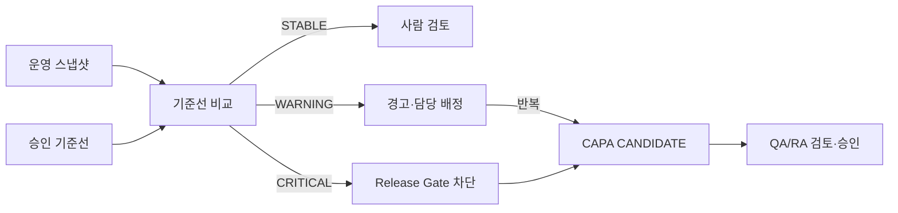

# Phase 27 — 모델 운영 모니터링과 드리프트

## 목적과 범위

익명 운영 집계로 입력·처리·검토·sLLM·검색·정합성 상태를 관찰하고, 기준선과 현재 구간의 분포 변화가 위험할 때 모델 릴리스를 차단하고 CAPA 후보를 만든다. 드리프트는 성능 저하나 진단 오류를 의미하지 않으며 실제 정답이 없으면 임상 성능은 `NOT_MEASURED`이다.

## 지표와 기준선

스냅샷은 요청 성공·실패, 평균/P50/P95/P99 latency, 품질 REJECT, OOD, UNKNOWN, 검토·수정, 부위·장비·기관·촬영 방향·모델 분포, API·sLLM·검색·정합성 실패율을 저장한다. 데이터가 없으면 null/`NOT_MEASURED`, 최소 30건 미만이면 `INSUFFICIENT_DATA`로 표시한다. 기준선은 ML_ENGINEER 또는 QA_RA가 모델·데이터셋 버전과 함께 승인 등록한다.

## 판정 방법

범주형 분포에는 Jensen–Shannon divergence, 비율 변화에는 기준값 대비 상대 변화를 사용한다. 기본 경계는 WARNING 0.10, CRITICAL 0.25이며 평가 증적에 버전과 경계를 저장한다. 단일 구간의 정답 없는 변화로 성능 저하를 주장하지 않는다.

## 배포 차단과 CAPA

CRITICAL 드리프트, 체크포인트 해시·검증 데이터 버전 불일치, 모니터링 증적 누락, 최근 고위험 정합성 실패, 미승인 모델을 차단한다. 결과에는 사유·증적·조치·담당 역할을 포함하고 자동 승인·배포하지 않는다. 동일 CRITICAL 드리프트 2회 또는 WARNING 3회부터 CAPA를 오직 `CANDIDATE`로 생성한다.

## 역할·시험·한계

스냅샷은 ML_ENGINEER/QA_RA/ADMIN, 기준선은 ML_ENGINEER/QA_RA, 경고 해결은 QA_RA/ADMIN이 수행한다. 합성 분포로 STABLE/WARNING/CRITICAL, 표본 부족, 401/403, 버전 충돌, 배포 차단, CAPA 비자동 승인을 시험한다. 실제 PACS, 외부 시계열 저장소, 알림 채널, 임상 정답 기반 성능 검증은 `NOT_CONFIGURED` 또는 `NOT_MEASURED`이며 운영 전 임계값 검증·보존 정책·부하시험이 필요하다.
